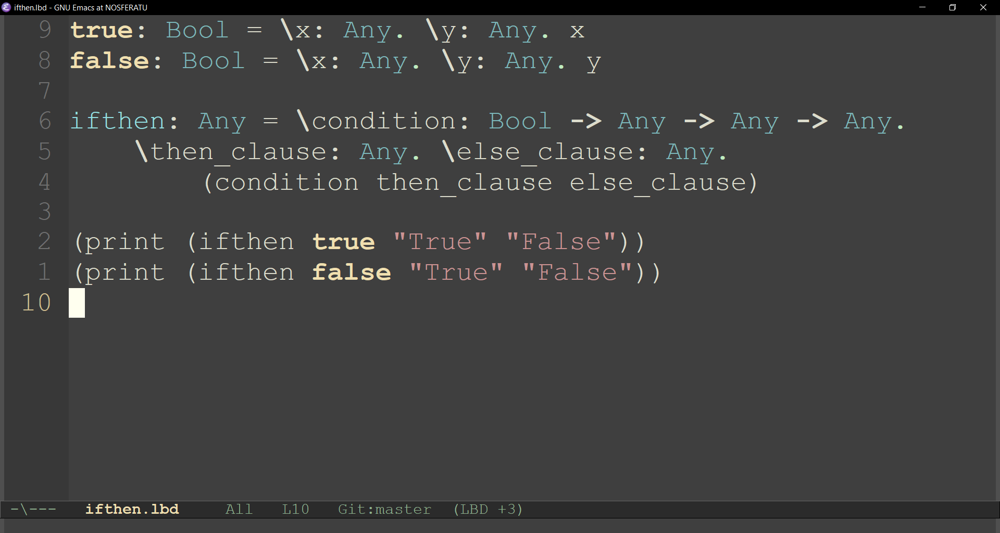
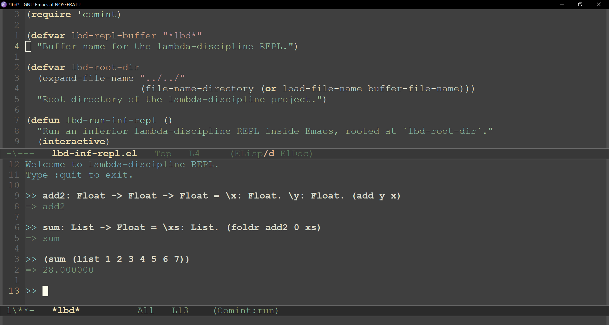

## Lambda Discipline Major Mode for Emacs

### Getting Started

1. `C-x C-f lbd-mode.el RET`
2. `M-x eval-buffer RET`
3. `M-x lbd-mode RET`

## Running the REPL inside Emacs

To interact with the `lambda-discipline` REPL directly inside Emacs, you can use the provided `lbd-inf-repl.el` script. This sets up an **inferior REPL buffer** powered by `comint-mode`.

### Getting Started

1. `C-x C-f lbd-inf-repl.el RET`
2. `M-x eval-buffer RET`
3. `M-x lbd-run-inf-repl RET`

This will open a buffer called `*lbd*` and start the REPL using `./cmake-build-debug/lbd.exe --repl` with the project root (`../../`) as the working directory.

### Sending Code to the REPL

- Select a region in your buffer and press `C-c C-e` to send it to the REPL.
- You can also type directly into the `*lbd*` buffer just like a normal shell.

### Notes

- The REPL runs with the project root set as the working directory, so relative paths (e.g. `:load examples/foo.lbd`) work the same as on the command line.
- If you update the REPL binary, just restart Emacs or rerun `M-x run-lbd`.
